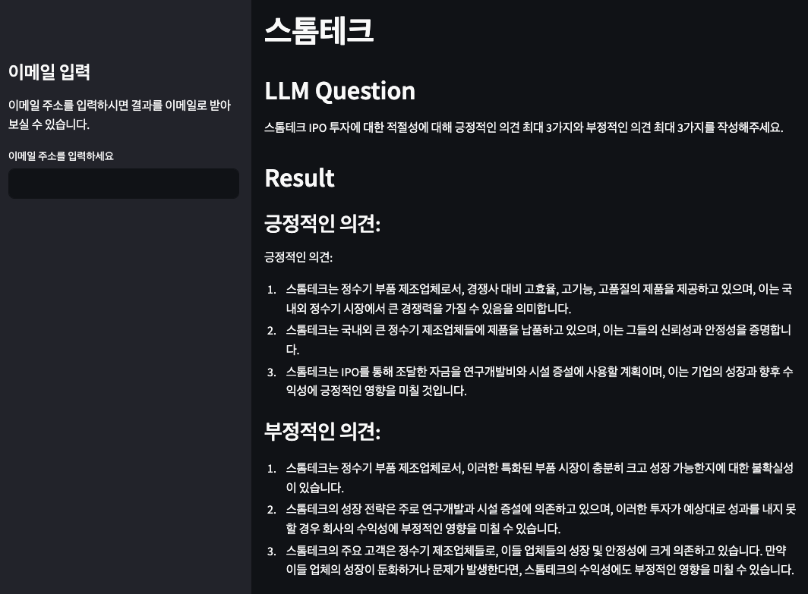

# IPO



- IPO 투자 판단을 위해 ChatGPT의 도움을 받아보려는 프로젝트입니다.

## Project Environment

- `python 3.11`
- `Ubuntu 20.04 LTS`

## In Case of a Chrome Error

```
wget -q -O - https://dl-ssl.google.com/linux/linux_signing_key.pub | sudo apt-key add -
sudo sh -c 'echo "deb [arch=amd64] http://dl.google.com/linux/chrome/deb/ stable main" >> /etc/apt/sources.list.d/google.list'
sudo apt-get update
sudo apt-get install google-chrome-stable
```
